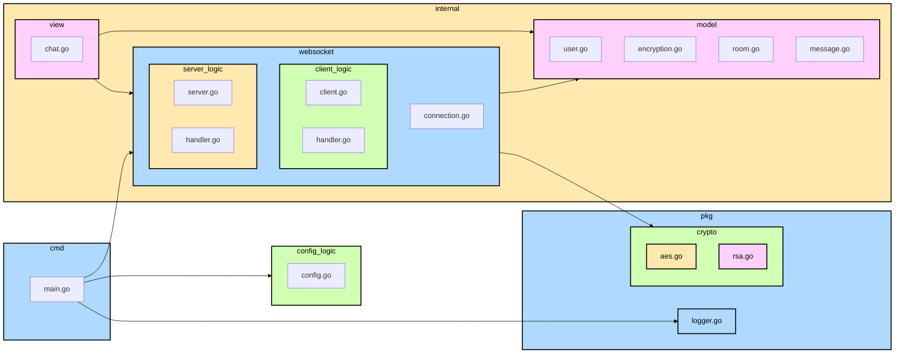

# End-to-End (E2E) Encrypted Chat in Golang

A privacy-focused chat application built with Golang, WebSockets, and [Bubble Tea](https://github.com/charmbracelet/bubbletea) for a rich terminal user interface.

**Privacy and End-to-End Encryption:**

This project prioritizes user privacy through end-to-end encryption (E2E). Unlike traditional chat applications that store messages on a central server, this project ensures that **only the conversation participants can read the messages**.

**Client-Server Architecture and the Privacy Focus:**

While a client-server architecture with WebSockets is used to facilitate real-time communication, **the server acts solely as a conduit for encrypted messages**. The server **does not have access to encryption keys or message content**.

The secure connection establishment (handshake) flow is as follows:

1.  Clients establish independent WebSocket connections with the server.
2.  Clients exchange public keys using RSA through the server. The server simply relays these keys without storing or analyzing them.
3.  Once public keys are exchanged, a symmetric key (AES) is generated on the initiating client.
4.  This symmetric key is encrypted with the recipient's public key and sent through the server.
5.  The recipient decrypts the symmetric key using their private key.
6.  From this point on, all messages are encrypted with the shared symmetric key using AES and transmitted through the server.

**This process ensures that:**

*   **The server never has access to the symmetric keys or the message content.**
*   **Only the conversation participants can decrypt the messages.**
*   Privacy is maintained even in a client-server architecture.

**Key Technologies:**

*   **Golang:** Programming language for the backend and encryption logic.
*   **WebSockets:** For real-time communication between clients and the server.
*   **RSA and AES:** Asymmetric and symmetric encryption algorithms, respectively, for key exchange and message encryption.
*   **Bubble Tea:** Framework for building interactive terminal user interfaces.

## Key Features

*   **End-to-End Encryption (E2E):** Messages are encrypted on the sender's device and only decrypted on the recipient's device. No one else, not even the application itself, can read them.
*   **Security:** Robust cryptographic algorithms are used:
    *   RSA for secure exchange of symmetric keys.
    *   AES for message encryption.
*   **Real-time communication:** WebSockets are used for smooth and instant communication.
*   **Secure key management:** Private keys are never transmitted or stored insecurely.

## Architecture

The project is divided into the following main packages:

*   `cmd/server`: Contains the main entry point of the application (`main.go`).
*   `config`: Manages application configuration, including cryptographic keys (`config.go`).
*   `internal/websocket`: Handles WebSocket communication.
    *   `client.go`: Manages individual WebSocket connections.
    *   `message.go`: Defines message and payload structures.
*   `pkg/chat`: Contains the chat logic.
    *   `encryption.go`: Chat-specific encryption functions.
    *   `message.go`: Chat message structures.
    *   `room.go`: Chat room logic.
    *   `user.go`: Defines the `User` structure.
*   `pkg/crypto`: Contains the encryption implementation.
    *   `aes.go`: Functions for AES encryption.
    *   `rsa.go`: Functions for RSA encryption.
*   `logger`: Contains the application's logging logic.

### Package Description

*   **`cmd/`**: Contains the main entry point of the application (`main.go`). This file is responsible for parsing the `-server` and `-client` flags to start the application in the corresponding mode. The main application logic resides in the packages within `internal`.

*   **`config/`**: Contains the application's configuration files, such as server configuration, cryptographic keys, etc.

*   **`internal/`**: Contains the application's internal source code. This code *should not be imported by external projects*.

    *   **`view/`**: Contains the user interface logic, using the Bubble Tea library. The `chat.go` file defines the model, update logic (`Update`), and view (`View`) of the chat.

    *   **`model/`**: Defines the data structures used for communication via WebSockets.
        *   `chat.go`: Contains the models related to the chat state in the user interface (`ModelChat`, `IncomingMessage`, etc.). `IncomingMessage` is used to communicate messages from the WebSocket layer to the UI layer.
        *   `message.go`: Contains the models that represent the messages exchanged through the WebSocket (`TextMessagePayload`, `WebsocketMessage`, etc.). `TextMessagePayload` is the data structure sent through the WebSocket. `WebsocketMessage` is a wrapper that contains the message type and the payload.

        *   `user.go`: Contains the model that represents the basic structure of a logged-in user on the platform.

    *   **`websocket/`**: Contains all logic related to WebSocket communication.

        *   **`client/`**: Specific logic for the WebSocket client, including:
            *   Establishing the WebSocket connection.
            *   Handling messages sent and received from the client.
            *   Integration with the user interface (in `internal/ui`).

        *   **`server/`**: Specific logic for the WebSocket server, including:
            *   Managing client connections.
            *   Broadcasting messages to connected clients.
            *   Handling connection and disconnection events.

        *   **`handler/`**: Handlers for different WebSocket events. These handlers contain the logic to process received messages and perform the corresponding actions (e.g., encrypt, decrypt, etc.).

        *   `connection.go`: Handles the creation, management, and closing of WebSocket connections, both on the client and server side.

*   **`pkg/`**: Contains reusable libraries *within the project*.

    *   **`crypto/`**: Contains the encryption functions.
        *   **`aes/`**: AES encryption implementation.
        *   **`rsa/`**: RSA encryption implementation.

    *   **`logger/`**: Contains the logic for log handling.

### Component Diagram

## Operating Flows

### Establishing a Secure Connection (Handshake)

Establishing a secure connection, or *handshake*, is crucial for end-to-end encryption. This process allows for the secure exchange of the symmetric key that will be used to encrypt messages. In an architecture with a central server, the server acts as an intermediary for this exchange.

**Scenario:** User A wants to start a conversation with user B (or create a new group).

**Case 1: Initial Public Key Exchange (A and B have not communicated before)**

This case occurs when A and B connect for the first time.

1.  **WebSocket Connection (Client A and Client B):** Clients A and B (in `internal/websocket/client/client.go`) establish *independent* WebSocket connections with the server (`internal/websocket/server/server.go`).

2.  **Public Key Exchange (through the server):**

    a.  **Sending Public Key (Client A -> Server):** Client A generates its RSA key pair (in `pkg/crypto/rsa/rsa.go`) if it doesn't already have one, and sends a `publicKeyExchange` type message (defined in `internal/websocket/model/message.go`) containing its RSA public key to the *server* through its WebSocket connection. The client handler (`internal/websocket/client/handler.go`) is responsible for formatting the message and sending it.

    b.  **Receiving and Relaying Public Key (Server Handler):** The server handler (`internal/websocket/server/handler.go`) receives the message from A, identifies the recipient B, and relays A's public key to B's client through B's WebSocket connection.

    c.  **Receiving and Storing Public Key (Client B Handler):** Client B's handler (`internal/websocket/client/handler.go`) receives A's public key and stores it in the user model (`internal/model/user.go`), associating it with A's ID.

    d.  **Sending Public Key (Client B -> Server):** Similar to step a, but B sends its public key to the server.

    e.  **Receiving and Relaying Public Key (Server Handler):** The server handler receives the message from B and relays it to A.

    f.  **Receiving and Storing Public Key (Client A Handler):** Similar to step c, but A receives and stores B's public key.

3.  **Symmetric Key Generation (Client A):** Client A generates a random symmetric key (AES) using `pkg/crypto/aes/aes.go`.

4.  **Symmetric Key Encryption (Client A):** Client A encrypts the generated symmetric key with B's public key using RSA (`pkg/crypto/rsa/rsa.go`).

5.  **Sending Encrypted Symmetric Key (Client A -> Server -> Client B):** Client A sends the encrypted symmetric key to the *server*, which in turn relays it to Client B. This is done within an `inviteToGroup` message (for group creation) or another similar message (for direct chats), handled by the handler.

6.  **Receiving Encrypted Symmetric Key (Client B Handler):** Client B's handler receives the message from the server.

7.  **Symmetric Key Decryption (Client B):** Client B decrypts the received symmetric key using *its* RSA private key (`pkg/crypto/rsa/rsa.go`).

8.  **Symmetric Key Storage (Client B):** Client B stores the decrypted symmetric key in the user model (`internal/model/user.go`), associating it with the conversation or group ID.

9.  **Encrypted Communication:** From this point on, A and B can communicate securely using the shared symmetric key. Encrypted messages will be sent through the server.

**Case 2: Public Keys Already Stored (A and B have communicated before)**

This case occurs when A and B have already communicated previously and have each other's public keys stored in their local configuration. The flow is similar to case 1, but the public key exchange steps (2a-2f) are omitted.

1.  **WebSocket Connection (Client A and Client B):** Clients A and B establish a WebSocket connection with the server.

2.  **Retrieving Public Keys (Client A and Client B):** Clients A and B retrieve each other's public keys from the user model (`internal/model/user.go`).

3.  **Symmetric Key Generation, Encryption, Sending, Receiving, Decryption, and Storage:** Steps 3-8 of Case 1 apply here.

4.  **Encrypted Communication:** From this point on, A and B can communicate securely using the shared symmetric key. Encrypted messages will be sent through the server.

### Sending a Message

This flow, in essence, doesn't change much with the introduction of the server, only that messages now pass through it:

1.  **Writing the Message (Chat View):** User A writes a message in the user interface (`internal/view/chat.go`).

2.  **Obtaining the Symmetric Key (Chat View):** The chat view (`internal/view/chat.go`) obtains the symmetric key from the user model (`internal/model/user.go`).

3.  **Encrypting the Message (Client A):** Client A (`internal/websocket/client/client.go`) encrypts the message with the symmetric key using AES (`pkg/crypto/aes/aes.go`).

4.  **Sending the Encrypted Message (Client A -> Server -> Client B):** Client A sends the encrypted message to the *server*, which in turn relays it to Client B. The client handler (`internal/websocket/client/handler.go`) is responsible for formatting the message to be sent.

5.  **Receiving the Encrypted Message (Client B Handler):** Client B's handler (`internal/websocket/client/handler.go`) receives the encrypted message *from the server*.

6.  **Obtaining the Symmetric Key (Client B):** Client B obtains the symmetric key from the user model (`internal/model/user.go`).

7.  **Decrypting the Message (Client B):** Client B decrypts the message with the symmetric key using AES (`pkg/crypto/aes/aes.go`).

8.  **Displaying the Message (Chat View):** Client B sends the decrypted message to the chat view (`internal/view/chat.go`) to be displayed to user B.

## How to Run the Application

#### You will need to run multiple instances in different terminals to simulate multiple users

1.  Clone the repository: `git clone https://github.com/osmancadc/go-encrypted-chat.git`
2.  Navigate to the project directory: `cd go-ecrypted-chat`
3.  Build and run the application: `./scripts/start.sh [-server] [-client] [username]`

## Contributions

This project is constantly evolving and there is always room for improvement. I believe that collaboration is the best way to learn and grow together.

If you are interested in learning about Go development, WebSockets, cryptography, or simply want to contribute to an open-source project, I invite you to participate. From bug fixes to the implementation of new features, your contribution is welcome.

Together we can make this project even better!

## License

[MIT License](https://opensource.org/licenses/MIT)
